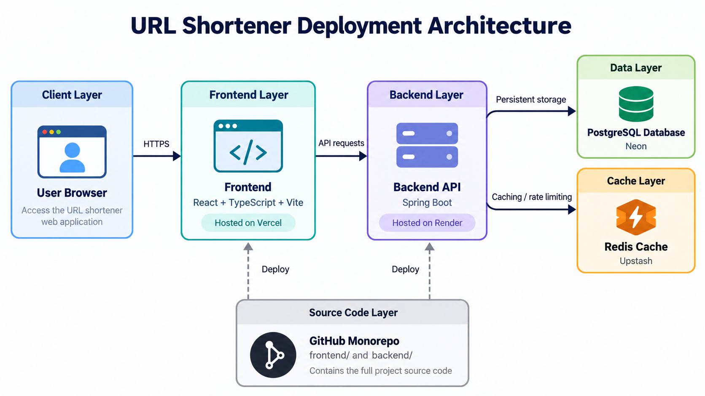

# URL Shortener

A full-stack URL shortener built with React and Spring Boot. It creates short links, redirects visitors, tracks clicks, supports expiration, and caches redirects with Redis.

## Live Demo

Frontend: [urlshortener-gray.vercel.app](https://urlshortener-gray.vercel.app/)

Backend API: [urlshortener-lgiy.onrender.com](https://urlshortener-lgiy.onrender.com/)

The backend runs on Render's free tier, so the first request after inactivity may take a little longer.

## Architecture



React frontend on Vercel → Spring Boot API on Render → Neon PostgreSQL and Upstash Redis.

## Features

- Create and redirect short URLs
- URL expiration and click analytics
- Redis caching and rate limiting
- API validation and useful error messages
- Copy shortened links to the clipboard
- Responsive frontend
- OpenAPI / Swagger documentation

## Stack

- Frontend: React, TypeScript, Vite, CSS
- Backend: Java 17, Spring Boot, JPA, Flyway
- Services: Neon PostgreSQL, Upstash Redis, Docker

## Run Locally

Requirements: Docker Compose, Java 17, Node.js, npm, and Make.

Start the local database and Redis dependencies:

```bash
make deps
```

Generate a local signing secret in the shell that starts the backend:

```bash
export JWT_SECRET="$(openssl rand -base64 32)"
```

Keep this value private and reuse it across restarts if existing tokens should remain valid.
Then start each service with its own target:

```bash
make backend-local
make frontend-local
```

Frontend: `http://localhost:5173`

API: `http://localhost:8081`
Swagger: `http://localhost:8081/swagger-ui/index.html`

Stop the local services with:

```bash
make down
```

## Environment

Local and deployment variable names are documented in:

- `backend/.env.example`
- `frontend/.env.example`

The frontend uses `VITE_API_URL`. The backend uses `DB_URL`, `DB_USERNAME`, `DB_PASSWORD`, `REDIS_URL`, `APP_BASE_URL`, `APP_FRONTEND_URL`, `JWT_SECRET`, and optional `JWT_EXPIRATION` (milliseconds, default `86400000`).

## Cookie authentication

Frontend requests use `credentials: "include"`. JWTs are stored in an HttpOnly,
host-only cookie, never in localStorage or JSON login responses. Production uses
`Secure; SameSite=None`; the local profile uses `SameSite=Lax` over HTTP.
Set `APP_FRONTEND_URL` to the exact frontend origin and `APP_BASE_URL` to the public backend origin.
CORS allows credentials only from that frontend origin.

Every write request (including register, login, and logout) must have an `Origin`
matching the configured frontend or backend origin. Missing, `null`, and foreign
origins return a JSON `403`. This strict origin check provides CSRF protection;
CLI clients must supply the trusted `Origin` header too. Bearer headers are no longer accepted.
Logout expires the cookie; copied JWTs remain valid until expiration.
Browsers that block third-party cookies may require hosting the frontend and backend on the same site.

## Authentication smoke test

In Swagger UI, call `POST /api/auth/register`, then `POST /api/auth/login`.
Login sets an HttpOnly `access_token` cookie; the response contains no JWT. Swagger sends the cookie automatically.
Create a URL with `POST /api/urls`, list it with `GET /api/urls?page=0&size=10&sort=createdAt,desc`,
and fetch its details with `GET /api/urls/{shortCode}`.
Register and log in as a second user: the first user's details must return `404` and their URLs must be absent from the list.
Call `POST /api/auth/logout` and confirm `GET /{shortCode}` redirects with `302`, while management endpoints return `401`.
Wrong credentials return `401`, duplicate registration `409`, rate limiting `429`, and expired redirects `410`.

## Checks

```bash
make test
```

Tests use the local PostgreSQL and Redis containers. Never commit real `.env` files or service credentials.
